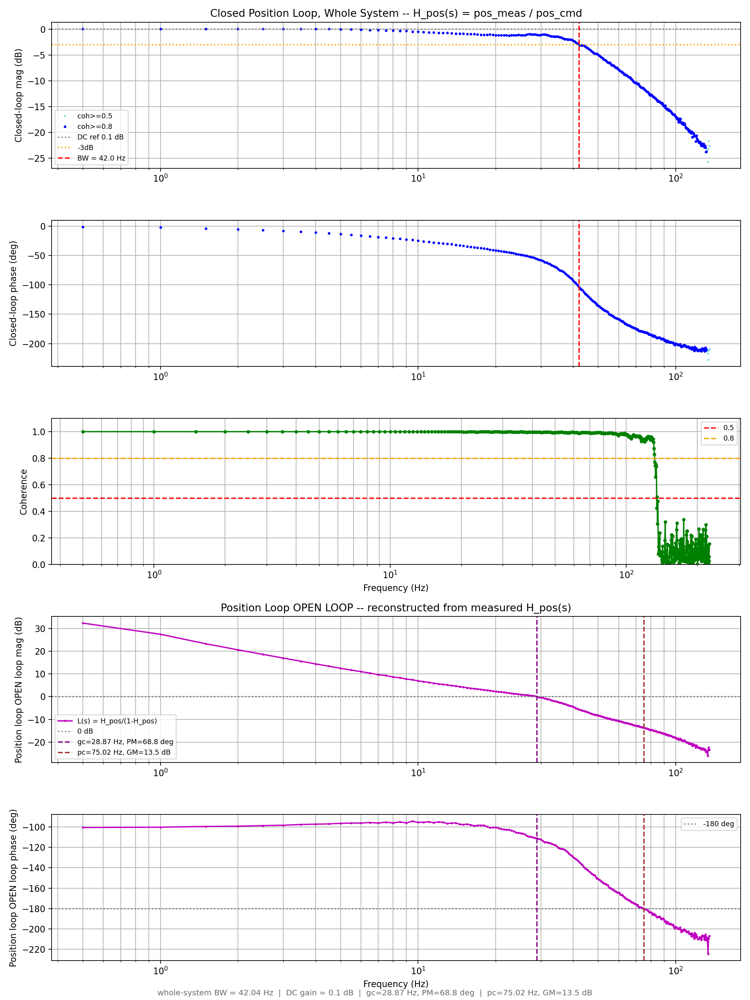
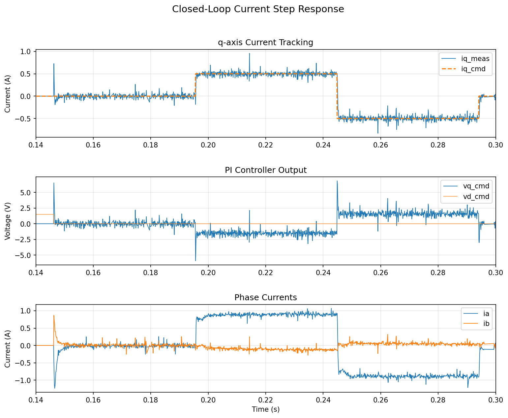
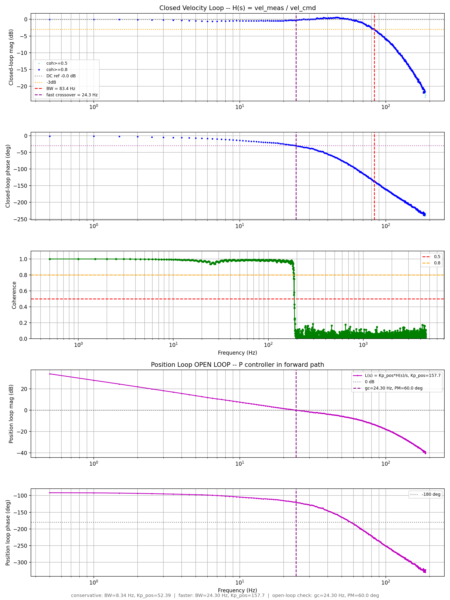
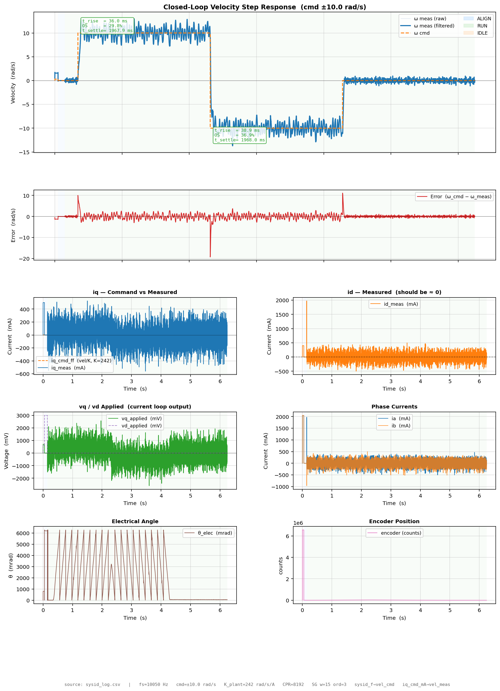
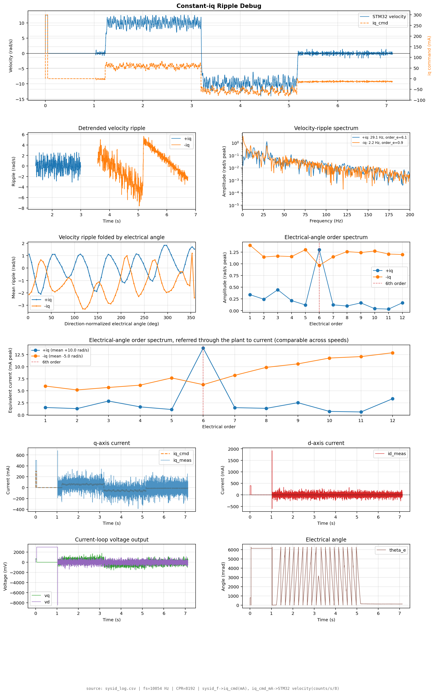
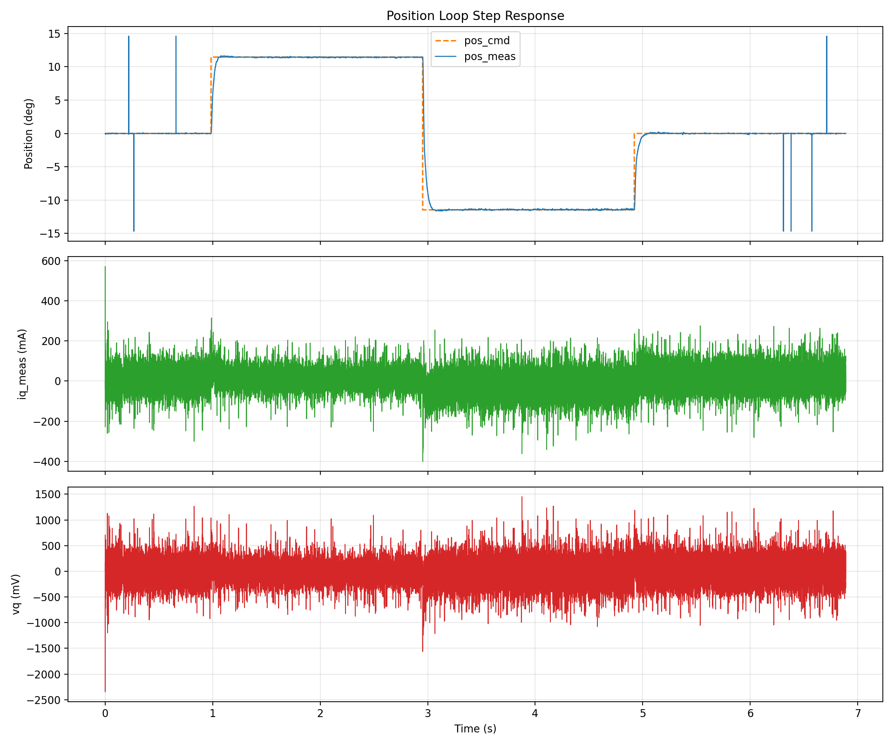

# foc-sysid

Raspberry Pi data capture and frequency-domain analysis for a bare-metal STM32 FOC servo drive.

Companion firmware: [stm32-servo-drive](https://github.com/jnzim/stm32-servo-drive)

**Status: full cascade closed and measured — current, velocity, and position.** Every
loop gain here was derived from real chirp/step-response system identification on actual
hardware, not a datasheet guess or an unverified rule of thumb. The position loop in
particular was designed from a phase-margin *target* (not the usual conservative "cross
over a decade below" heuristic) and then independently verified by chirping the entire
closed system and reconstructing the open-loop response straight from the measured data —
see [Position loop](#position-loop-closed-system) below.



## What it does

- Captures 32-byte telemetry frames from the STM32F411 over SPI at ~10 kHz, decoding
  whichever `SYSID_TEST` the firmware was compiled for (the STM32 stamps its compile-time
  test ID into the telemetry, so this side never has to guess which one ran)
- Triggers the STM32 sysid sequence through a GPIO handshake
- **Loops automatically**: re-arms after every capture instead of exiting, so you flash a
  new build, hit Enter, and it captures + analyzes + opens the resulting plots without
  restarting the tool — see [Workflow](#workflow)
- Logs timestamped CSV telemetry (encoder position, d/q currents, voltage commands,
  command/measured position or velocity depending on the active test)
- Auto-dispatches to the right analysis script for whichever test just ran, and opens any
  new plots on the Pi's attached display
- Computes Bode plots (Welch CSD/coherence) for the current-loop plant, the closed
  velocity loop, and the closed position loop (whole system)
- Renders a synced scrolling video overlay (`cine_overlay_render.py`) of a slow, filmable
  sine sweep for demoing tracking behavior alongside real footage

## Current loop — plant sysid

| Parameter | Measured | Datasheet (line-to-line) | Method |
|-----------|----------|--------------------------|--------|
| R | 3.55 Ω | 3.10 Ω | Bode DC magnitude |
| L | 2.47 mH | 2.04 mH | Bode -3 dB, `fc = 229 Hz` |
| fc | 229 Hz | 241 Hz | Bode -3 dB from flat response |

> Measured R and L are slightly higher than the datasheet values, consistent with additional series resistance and inductance from the long motor cable used in the test setup.

The current-loop PI gains were calculated from this measured first-order RL plant and
implemented on the STM32 at 20 kHz, including a d-axis PI added later to cancel a real
cross-coupling bias (`i_d = ω_e·L_q·i_q/R`) that otherwise grew with speed.



## Velocity loop — closed, 82.5 Hz bandwidth

The velocity loop closes around the current loop above and was retuned after its initial
gains turned out to be ~3.4x smaller than the sysid-calculated design called for — measured
closed-loop bandwidth went from 7.5 Hz to 82.5 Hz after the fix.




A real order-6 electrical (order-18 mechanical) velocity ripple was also characterized
during this work — confirmed repeatable and independent of PWM dead-time, best explained
by cogging torque (motor is 9-slot/6-pole, LCM=18 matches), but not independently
root-caused (a zero-current coast test to isolate it was tried and abandoned — too much
bench friction to coast usefully).



## Position loop — closed system

Rather than use the standard conservative heuristic (cross the outer loop over a decade
below the inner loop's bandwidth, which gets you *something* stable but never tells you
your actual margin), the position P gain was designed by measuring the closed velocity
loop's real phase lag and targeting a specific phase margin directly:
`Kp_pos = 157.7`, targeting 60° PM from a 30° phase-lag crossover point.

That design was then checked against reality, not just trusted: `SYSID_TEST_CL_POS_CHIRP`
chirps `pos_cmd` through the **entire closed cascade** (position P → velocity PI → current
PI) and measures the actual whole-system closed-loop response `H_pos(s) = pos_meas/pos_cmd`
directly — no `H(s)/s` construction, no assumptions. The open-loop response is then
reconstructed straight from that measurement (`L = H/(1-H)`, valid for unity feedback) to
pull out gain/phase margin without ever needing to physically break the loop.

**Measured result: 42.0 Hz closed-loop bandwidth, gain crossover 28.9 Hz, 68.8° phase
margin, 13.5 dB gain margin** — healthier margins than the 60° PM originally targeted.



A slow "cine sweep" variant of the same closed-loop chirp (`SYSID_TEST_CINE_SWEEP`, 3–80 Hz
instead of the analysis sweep range) exists specifically for filming — visible motion
instead of an inaudible/invisible fast chirp, deliberately swept past the loop's real
limit so you can watch it track cleanly and then visibly fall behind.

## Hardware

- Raspberry Pi 5
- STM32F411RE Nucleo-64 — bare metal, no HAL
- Texas Instruments DRV8353RS-EVM gate driver
- 7 mΩ low-side shunt resistors with CSA gain of 10 V/V
- Kollmorgen AKM11E BLDC motor
- 3 pole pairs
- 8192-count RS-422 encoder
- SPI0 at 4 MHz with telemetry capture at ~10 kHz
- GPIO3 to STM32 PC3 active-low trigger

## Build

```bash
mkdir build
cd build
cmake ..
make -j4
./drive
```

## Workflow

`./drive` loops instead of exiting: flash the STM32 for whichever `SYSID_TEST` you want,
then at the prompt hit Enter once it's booted and ready. The tool triggers the capture,
writes `drive_data/latest/sysid_log.csv`, auto-selects and runs the matching analysis
script(s) based on the test ID the firmware stamped into its own telemetry, and opens any
new plots on the Pi's attached display — then re-arms and waits for Enter again so you can
reflash a different test and go straight into the next capture.

## Analysis

Scripts are dispatched automatically by `./drive`, but can be run standalone against any
capture:

| Script | `SYSID_TEST` | What it shows |
|--------|--------------|---------------|
| `bode_plot.py` | current loop chirp | Current-loop plant Bode, curve-fit R/L/fc |
| `step.py` | current loop step | Closed-loop current step response |
| `bode_vel_plot.py`, `vel_v_t.py` | velocity chirp | Open-loop velocity plant Bode |
| `velocity_step_plot.py` | closed velocity step | Closed-loop velocity step response |
| `ripple_debug_plot.py` | ripple debug | Order-domain ripple analysis, split-half repeatability |
| `closed_vel_bode_plot.py` | closed velocity chirp | Closed velocity loop Bode + phase-margin-targeted `Kp_pos` design |
| `position_step_plot.py` | position step | Closed position loop step response (position + velocity + current) |
| `closed_pos_bode_plot.py` | closed position chirp | Whole-system closed-loop Bode + reconstructed open-loop PM/GM |
| `cine_overlay_render.py` | cine sweep | Renders a synced scrolling video overlay (cmd vs. measured) for filming |

Copy any new result images into `docs/` before committing so the README stays current.

## Roadmap

- [x] Current-loop plant sysid — R, L, and fc confirmed
- [x] Current-loop PI closure, including d-axis cross-coupling fix
- [x] Velocity-loop plant sysid and closure — 82.5 Hz measured bandwidth
- [x] Position-loop closure — phase-margin-targeted design, verified against the measured
      whole-system closed loop (42 Hz BW, 68.8° PM, 13.5 dB GM)
- [x] Auto-selecting analysis workflow, re-arm loop between tests
- [ ] Independently confirm the velocity ripple's root cause (cogging torque suspected,
      not proven — coast test attempt abandoned due to bench friction)
- [ ] Connect a real stage and re-run full sysid against that plant (gains above are
      bare-motor only)
- [ ] Trapezoidal trajectory-streaming motion controller on top of the validated cascade
