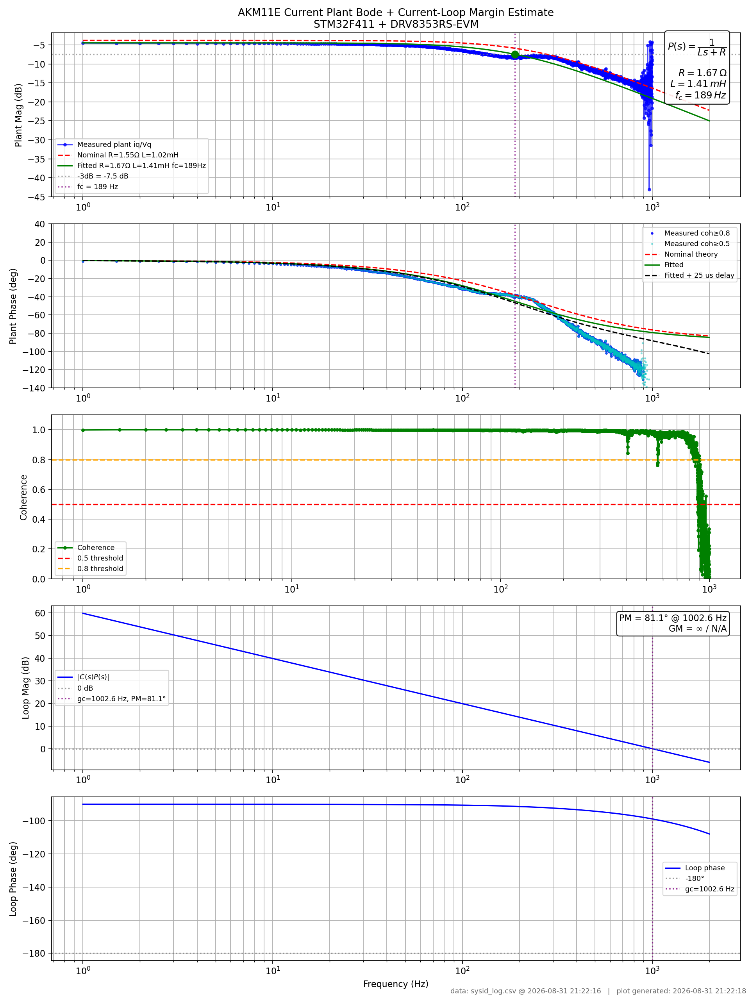

# rpi-sysid

Raspberry Pi data capture and frequency-domain analysis for a bare-metal STM32 FOC servo drive.

Companion firmware: [stm32-servo-drive](https://github.com/jnzim/stm32-servo-drive)



## What it does

- Captures 32-byte telemetry frames from STM32F411 over SPI at ~10kHz
- Triggers STM32 sysid sequence via GPIO handshake
- Logs timestamped CSV: encoder position, d/q currents, voltage commands, chirp frequency
- Computes current loop plant Bode plot via Welch CSD estimation
- Extracts R, L, fc from measured frequency response
- Overlays confirmed plant model H(s) = 1/(Ls + R) with phase margin analysis

## Current results — AKM11E motor

| Parameter | Value | Method |
|-----------|-------|--------|
| R (line-to-line) | 3.55 Ω | Bode DC magnitude |
| L | 2.47 mH | fc = 229Hz |
| fc | 229 Hz | Bode -3dB point |

## Hardware

- Raspberry Pi 5
- STM32F411RE Nucleo-64 (bare metal firmware)
- SPI0 at 4 MHz
- GPIO3 → STM PC3 trigger

## Build

```bash
mkdir build && cd build
cmake ..
make -j4
./drive
```

## Analysis

```bash
python3 py-script/bode_plot.py drive_data/sysid_log.csv
```

## Roadmap

- [x] Current loop plant sysid — R, L confirmed
- [ ] Closed current loop step response
- [ ] Velocity loop plant sysid — J, B, Kt
- [ ] Velocity loop closure