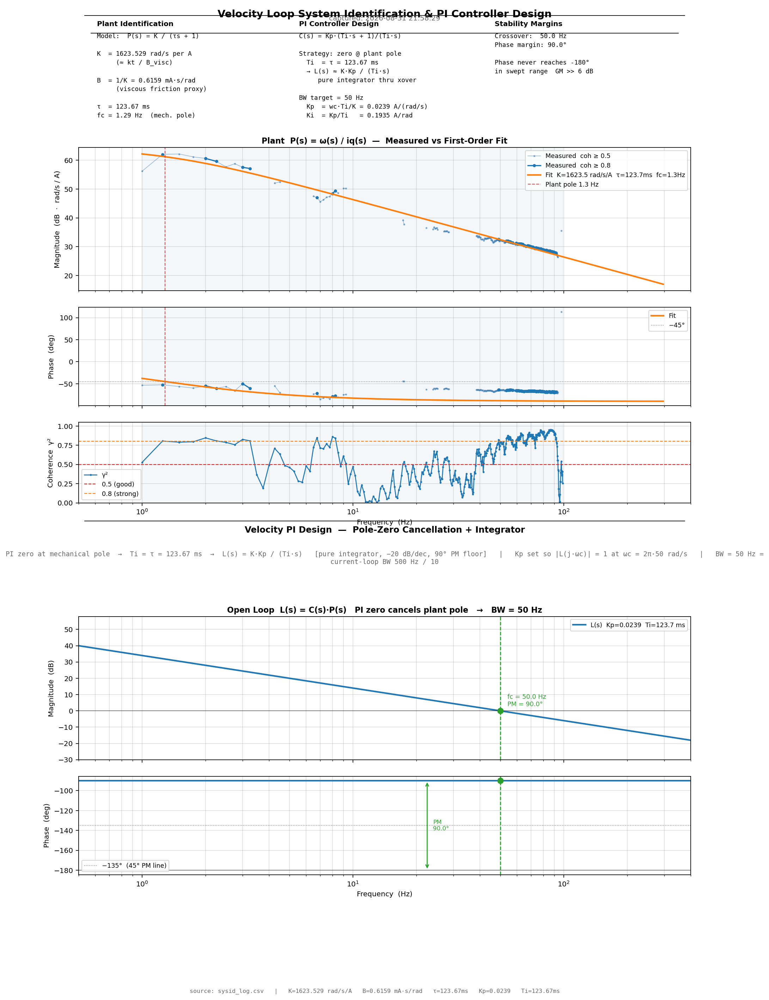

# foc-sysid

Raspberry Pi data capture and frequency-domain analysis for a bare-metal STM32 FOC servo drive.

Companion firmware: [stm32-servo-drive](https://github.com/jnzim/stm32-servo-drive)

**Status: full cascade closed and measured — current, velocity, and position — on a real
stage** (previously bare motor; the stage is now attached and every loop below was
re-identified against it). Every loop gain here was derived from real chirp/step-response
system identification on actual hardware, not a datasheet guess or an unverified rule of
thumb. The position loop was originally sized from a phase-margin *target* built off the
closed velocity loop's measured phase — but that target kept landing right against a real
mechanical resonance the velocity-loop chirp surfaced once the stage was attached, so it
was deliberately backed off instead; see [Velocity loop](#velocity-loop--re-identified-with-stage-attached-resonance-found)
and [Position loop](#position-loop-closed-system) below.


## What it does

- Captures 32-byte telemetry frames from the STM32F411 over SPI at ~10 kHz, decoding
  whichever `SYSID_TEST` the firmware was compiled for (the STM32 stamps its compile-time
  test ID into the telemetry, so this side never has to guess which one ran)
- Triggers the STM32 sysid sequence through a GPIO handshake
- **Loops automatically**: re-arms after every capture instead of exiting, so you flash a
  new build, hit Enter, and it captures + analyzes + opens the resulting plots without
  restarting the tool — see [Workflow](#workflow)
- Logs timestamped CSV telemetry (encoder position, d/q currents, voltage commands,
  command/measured position or velocity depending on the active test)
- Auto-dispatches to the right analysis script for whichever test just ran, and opens any
  new plots on the Pi's attached display
- Computes Bode plots (Welch CSD/coherence) for the current-loop plant, the closed
  velocity loop, and the closed position loop (whole system)
- Renders a synced scrolling video overlay (`cine_overlay_render.py`) of a slow, filmable
  sine sweep for demoing tracking behavior alongside real footage

## Current loop — plant sysid

| Parameter | Measured | Datasheet (line-to-line) | Method |
|-----------|----------|--------------------------|--------|
| R | 1.67 Ω | 3.10 Ω | Bode DC magnitude |
| L | 1.41 mH | 2.04 mH | Bode -3 dB, `fc = 189 Hz` |
| fc | 189 Hz | 241 Hz | Bode -3 dB from flat response |

> Re-identified this session with a fresh chirp; used to re-target the current-loop PI
> design from 500Hz to 1000Hz BW (real margin to spare at 500Hz — PM was landing at
> 85-88°). At the new design, measured loop margin is **PM = 81.1° @ gc = 1002.6 Hz**,
> GM effectively infinite (phase never approaches -180° in the swept range) — a full
> decade below the 20 kHz control loop's 10 kHz Nyquist limit.

The current-loop PI gains were calculated from this measured first-order RL plant and
implemented on the STM32 at 20 kHz, including a d-axis PI added earlier to cancel a real
cross-coupling bias (`i_d = ω_e·L_q·i_q/R`) that otherwise grew with speed.


## Velocity loop — re-identified with stage attached, resonance found

The velocity loop closes around the current loop above. With the stage now attached, the
mechanical plant changed substantially from the bare-motor fit this replaces (a much
heavier, more damped load): `K = 1623.5 rad/s/A`, `τ = 123.67 ms`, vs. the old bare-motor
numbers (`K ≈ 238-248 rad/s/A`, `τ ≈ 13 ms`). PI gains were re-derived by the same
zero-cancellation method, 50Hz BW target.



Chirping the **closed** velocity loop (`vel_meas/vel_cmd`) surfaced a real resonance that
wasn't visible on the bare motor: a dip-then-peak shape (anti-resonance ~15-30Hz, resonance
~65-90Hz) — the classic signature of a two-inertia system, motor and load coupled through
the screw/coupling's compliance. An amplitude sweep of the open-loop plant chirp
(`VEL_CHIRP_AMPLITUDE` = 0.35 / 0.5 / 0.75 / 0.9 A) showed that resonance's frequency and
damping **both move non-monotonically with excitation amplitude** — a fixed linear mode
wouldn't do that. Most likely explanation: backlash in the coupling modulating effective
stiffness under load, not yet confirmed or fixed mechanically.

| Amplitude | Phase crossover (pc) | Gain margin | Auto-designed `Kp_pos` (60° PM target) |
|-----------|----------------------|-------------|------------------------------------------|
| 0.35 A | 85.15 Hz | 3.2 dB | 638.9 |
| 0.5 A  | 78.87 Hz | 3.4 dB | 481.4 |
| 0.75 A | 85.80 Hz | 3.4 dB | 645.3 |
| 0.9 A  | 82.70 Hz | 3.7 dB | 559.0 |

Every one of those is a thin margin sitting right against the resonance, and the resonance
itself won't hold still — a fixed notch filter tuned to any one of these would be wrong for
the others. This is what drove the position-loop decision below.


A real order-6 electrical (order-18 mechanical) velocity ripple was also characterized
during earlier bare-motor work — confirmed repeatable and independent of PWM dead-time,
best explained by cogging torque (motor is 9-slot/6-pole, LCM=18 matches), but not
independently root-caused (a zero-current coast test to isolate it was tried and abandoned
— too much bench friction to coast usefully). The resonance above is a separate, later
finding; the two haven't been connected yet, though both point at unmodeled
mechanical/friction behavior worth revisiting together.


## Position loop — closed system

The position P gain was originally designed by measuring the closed velocity loop's real
phase lag and targeting a specific phase margin directly (crossover picked where measured
phase lag = 30°, targeting 60° PM) — see the table above. That approach kept landing gc
around 41-43Hz across every amplitude tested, right against the resonance found above with
only 3.2-3.7 dB of gain margin.

Rather than trust a precise design against a target that's been measured to move, or add a
notch filter tuned to a resonance that hasn't held still across four tests, the gain was
deliberately backed off instead: `Kp_pos = 200` (down from the phase-margin-targeted
design), landing crossover around 15-20Hz — comfortably clear of the resonance band
regardless of which amplitude it's currently sitting at.

That was then checked against reality, not just trusted: `SYSID_TEST_CL_POS_CHIRP` chirps
`pos_cmd` through the **entire closed cascade** (position P → velocity PI → current PI) and
measures the actual whole-system closed-loop response `H_pos(s) = pos_meas/pos_cmd`
directly — no `H(s)/s` construction, no assumptions. The open-loop response is then
reconstructed straight from that measurement (`L = H/(1-H)`, valid for unity feedback) to
pull out gain/phase margin without ever needing to physically break the loop.

**Measured result: 21.5 Hz closed-loop bandwidth, gain crossover 20.17 Hz, 82.8° phase
margin, 18.6 dB gain margin** — and the reconstructed open-loop magnitude rolls off
smoothly straight through the 65-90Hz resonance band with no bump at all at this crossover.
Confirmed with an actual position step move as well (`SYSID_TEST_POSITION_STEP`): clean
ramp-limited tracking, no overshoot, no ringing.


Velocity feedforward (not yet implemented) is the planned way to recover tracking
performance without spending this margin back. A notch filter is deliberately not on the
table yet — see [Velocity loop](#velocity-loop--re-identified-with-stage-attached-resonance-found)
for why a fixed notch is a bad bet on a resonance that's already been observed to move.

A slow "cine sweep" variant of the same closed-loop chirp (`SYSID_TEST_CINE_SWEEP`, 3–80 Hz
instead of the analysis sweep range) exists specifically for filming — visible motion
instead of an inaudible/invisible fast chirp, deliberately swept past the loop's real
limit so you can watch it track cleanly and then visibly fall behind.

## Hardware

- Raspberry Pi 5
- STM32F411RE Nucleo-64 — bare metal, no HAL
- Texas Instruments DRV8353RS-EVM gate driver
- 7 mΩ low-side shunt resistors with CSA gain of 10 V/V
- Kollmorgen AKM11E BLDC motor
- 3 pole pairs
- 8192-count RS-422 encoder
- SPI0 at 4 MHz with telemetry capture at ~10 kHz
- GPIO3 to STM32 PC3 active-low trigger
- Precision ball-screw stage (newly attached — previous results above were bare-motor)

## Build

```bash
mkdir build
cd build
cmake ..
make -j4
./drive
```

## Workflow

`./drive` loops instead of exiting: flash the STM32 for whichever `SYSID_TEST` you want,
then at the prompt hit Enter once it's booted and ready. The tool triggers the capture,
writes `drive_data/latest/sysid_log.csv`, auto-selects and runs the matching analysis
script(s) based on the test ID the firmware stamped into its own telemetry, and opens any
new plots on the Pi's attached display — then re-arms and waits for Enter again so you can
reflash a different test and go straight into the next capture.

## Analysis

Scripts are dispatched automatically by `./drive`, but can be run standalone against any
capture:

| Script | `SYSID_TEST` | What it shows |
|--------|--------------|---------------|
| `bode_plot.py` | current loop chirp | Current-loop plant Bode, curve-fit R/L/fc |
| `step.py` | current loop step | Closed-loop current step response |
| `bode_vel_plot.py`, `vel_v_t.py` | velocity chirp | Open-loop velocity plant Bode |
| `velocity_step_plot.py` | closed velocity step | Closed-loop velocity step response |
| `ripple_debug_plot.py` | ripple debug | Order-domain ripple analysis, split-half repeatability |
| `closed_vel_bode_plot.py` | closed velocity chirp | Closed velocity loop Bode + phase-margin-targeted `Kp_pos` design |
| `position_step_plot.py` | position step | Closed position loop step response (position + velocity + current) |
| `closed_pos_bode_plot.py` | closed position chirp | Whole-system closed-loop Bode + reconstructed open-loop PM/GM |
| `cine_overlay_render.py` | cine sweep | Renders a synced scrolling video overlay (cmd vs. measured) for filming |

Copy any new result images into `docs/` before committing so the README stays current.

## Roadmap

- [x] Current-loop plant sysid — R, L, and fc confirmed; BW target re-tuned 500→1000Hz
- [x] Current-loop PI closure, including d-axis cross-coupling fix
- [x] Connect a real stage and re-run full sysid against that plant (previous gains were
      bare-motor only)
- [x] Velocity-loop plant sysid and closure, re-identified with the stage attached
- [x] Mechanical resonance (65-90Hz, two-inertia signature) found via closed-velocity-loop
      chirp; confirmed amplitude-dependent (likely backlash) via a 4-point amplitude sweep
- [x] Position-loop closure — backed off from the resonance-adjacent phase-margin-targeted
      design to a conservative `Kp_pos=200`, verified against the measured whole-system
      closed loop (21.5 Hz BW, 82.8° PM, 18.6 dB GM) and an actual position step move
- [x] Auto-selecting analysis workflow, re-arm loop between tests
- [ ] Check the stage coupling for backlash (suspected root cause of the amplitude-dependent
      resonance)
- [ ] Velocity feedforward, to recover tracking performance without spending the position
      loop's margin back
- [ ] Independently confirm the velocity ripple's root cause (cogging torque suspected,
      not proven — coast test attempt abandoned due to bench friction); possibly related to
      the resonance above, not yet connected
- [ ] Trapezoidal trajectory-streaming motion controller on top of the validated cascade
